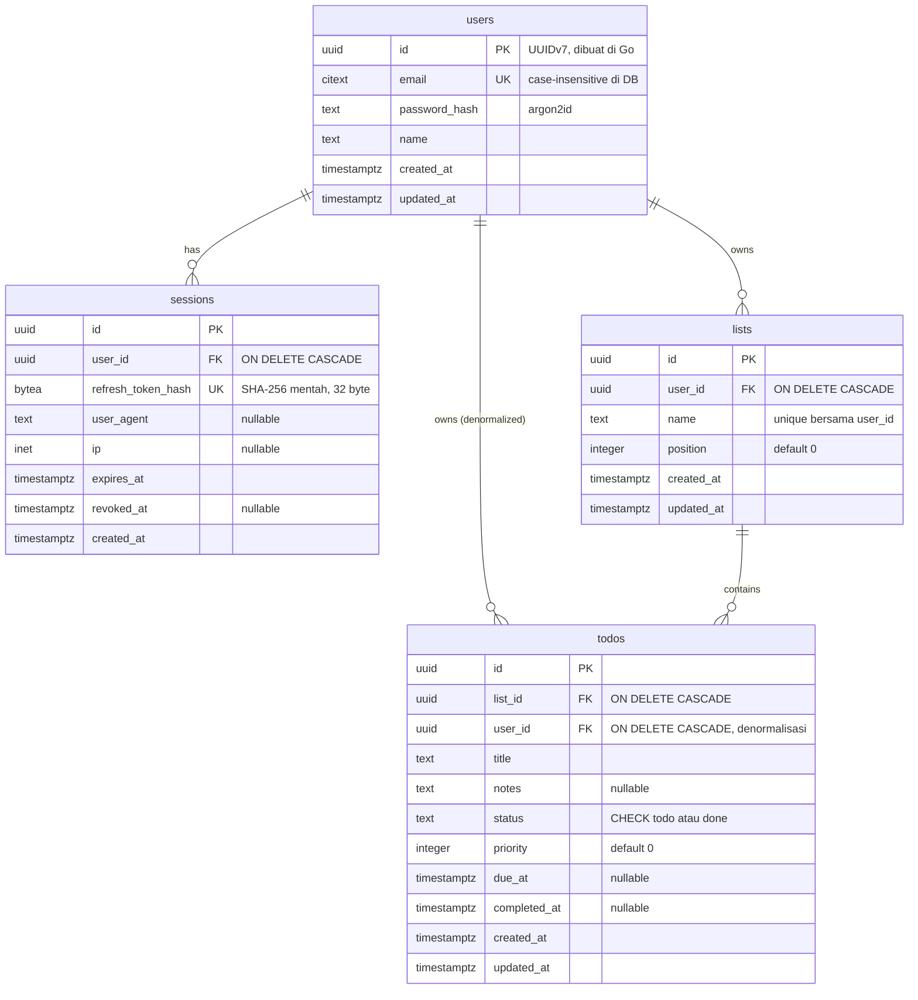
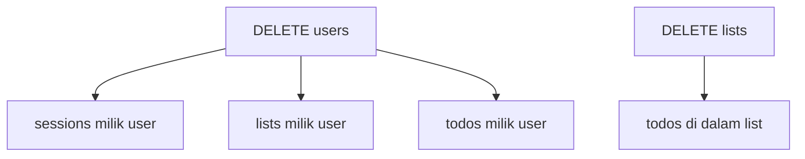

# DB-SCHEMA — apps/go-chi-api

Rujukan skema database untuk seluruh project. Satu database Postgres, satu
direktori migrasi (`db/migrations/`, goose). Pemisahan modul ada di kode Go,
bukan di schema — `identity` dan `task` berbagi database yang sama.

**Sumber kebenaran adalah file migrasi di `db/migrations/`, bukan dokumen ini.**
Kalau keduanya berbeda, migrasi yang benar dan dokumen ini yang harus diperbarui.

**Status:** schema belum dimigrasikan. `db/migrations/` masih kosong sampai
[task 01](tasks/01-database-migrations.md) dikerjakan. DDL di task itu adalah
bentuk yang dirujuk dokumen ini.

## ERD

## Tabel

### `users`

| Kolom | Tipe | Null | Default | Catatan |
| --- | --- | --- | --- | --- |
| `id` | `uuid` | tidak | — | UUIDv7 dibuat di Go lewat `internal/platform/id`, bukan `gen_random_uuid()` (ADR-009) |
| `email` | `citext` | tidak | — | `citext` supaya perbandingan dan unique constraint case-insensitive ditegakkan database, bukan dihafal di tiap query |
| `password_hash` | `text` | tidak | — | argon2id, di-hash di Go |
| `name` | `text` | tidak | — | |
| `created_at` | `timestamptz` | tidak | `now()` | |
| `updated_at` | `timestamptz` | tidak | `now()` | |

Constraint: `PRIMARY KEY (id)`, `UNIQUE (email)`.

Butuh extension `citext`. `pgcrypto` sengaja tidak dipasang — tidak ada kolom
yang memakainya, semua hashing terjadi di Go.

### `sessions`

| Kolom | Tipe | Null | Default | Catatan |
| --- | --- | --- | --- | --- |
| `id` | `uuid` | tidak | — | |
| `user_id` | `uuid` | tidak | — | FK ke `users(id)` |
| `refresh_token_hash` | `bytea` | tidak | — | SHA-256 mentah (32 byte biner) dari refresh token, bukan tokennya dan bukan hex/base64-nya (ADR-005) |
| `user_agent` | `text` | ya | — | |
| `ip` | `inet` | ya | — | tipe `inet` native, bukan `text` |
| `expires_at` | `timestamptz` | tidak | — | |
| `revoked_at` | `timestamptz` | ya | — | terisi saat rotasi refresh atau logout |
| `created_at` | `timestamptz` | tidak | `now()` | |

Constraint: `PRIMARY KEY (id)`, `FOREIGN KEY (user_id) → users(id) ON DELETE
CASCADE`, `UNIQUE (refresh_token_hash)`.

`UNIQUE` di `refresh_token_hash` yang menegakkan "satu refresh token hanya
valid sekali" di level database — bukan cuma di logika aplikasi.

### `lists`

| Kolom | Tipe | Null | Default | Catatan |
| --- | --- | --- | --- | --- |
| `id` | `uuid` | tidak | — | |
| `user_id` | `uuid` | tidak | — | FK ke `users(id)` |
| `name` | `text` | tidak | — | |
| `position` | `integer` | tidak | `0` | urutan tampil list milik user |
| `created_at` | `timestamptz` | tidak | `now()` | |
| `updated_at` | `timestamptz` | tidak | `now()` | |

Constraint: `PRIMARY KEY (id)`, `FOREIGN KEY (user_id) → users(id) ON DELETE
CASCADE`, `UNIQUE (user_id, name)`.

### `todos`

| Kolom | Tipe | Null | Default | Catatan |
| --- | --- | --- | --- | --- |
| `id` | `uuid` | tidak | — | |
| `list_id` | `uuid` | tidak | — | FK ke `lists(id)` |
| `user_id` | `uuid` | tidak | — | FK ke `users(id)`. Didenormalisasi — pemilik sebenarnya bisa diturunkan lewat `list_id → lists.user_id`, tapi hampir semua query perlu scoping ke pemilik (ADR-011) |
| `title` | `text` | tidak | — | |
| `notes` | `text` | ya | — | |
| `status` | `text` | tidak | `'todo'` | `CHECK (status IN ('todo', 'done'))` |
| `priority` | `integer` | tidak | `0` | |
| `due_at` | `timestamptz` | ya | — | |
| `completed_at` | `timestamptz` | ya | — | terisi saat `status` jadi `done` |
| `created_at` | `timestamptz` | tidak | `now()` | |
| `updated_at` | `timestamptz` | tidak | `now()` | |

Constraint: `PRIMARY KEY (id)`, `FOREIGN KEY (list_id) → lists(id) ON DELETE
CASCADE`, `FOREIGN KEY (user_id) → users(id) ON DELETE CASCADE`,
`CHECK (status IN ('todo', 'done'))`.

`status` pakai `text` + `CHECK`, bukan enum Postgres. Menambah nilai ke enum
butuh `ALTER TYPE ... ADD VALUE` yang tidak bisa jalan di transaksi yang sama
dengan pemakaiannya, dan menghapus nilai enum tidak didukung sama sekali.
`CHECK` diubah dengan `DROP CONSTRAINT` + `ADD CONSTRAINT` — satu migrasi biasa.

## Kenapa semua timestamp `timestamptz`

`timestamp` tanpa zona menyimpan angka jam apa adanya, jadi nilainya ambigu
kalau server dan klien beda zona atau server pindah region. `timestamptz`
disimpan Postgres sebagai UTC dan dikonversi ke zona sesi saat dibaca, jadi
selalu merujuk satu titik waktu absolut yang sama.

## Index

| Index | Tabel | Kolom | Jenis | Dipakai untuk |
| --- | --- | --- | --- | --- |
| `users_pkey` | `users` | `(id)` | PK, unique | lookup by id |
| `users_email_key` | `users` | `(email)` | unique | lookup saat login dan cek email terpakai saat register; case-insensitive lewat `citext` |
| `sessions_pkey` | `sessions` | `(id)` | PK, unique | lookup by id |
| `sessions_refresh_token_hash_key` | `sessions` | `(refresh_token_hash)` | unique | lookup saat refresh, sekaligus menegakkan satu token sekali pakai |
| `sessions_user_id_idx` | `sessions` | `(user_id)` | btree | cabut semua session milik satu user (logout-all dan reuse detection) |
| `lists_pkey` | `lists` | `(id)` | PK, unique | lookup by id |
| `lists_user_id_name_key` | `lists` | `(user_id, name)` | unique | cegah nama list duplikat per user; prefix `(user_id)` juga melayani "semua list milik user" |
| `todos_pkey` | `todos` | `(id)` | PK, unique | lookup by id |
| `todos_user_status_due_idx` | `todos` | `(user_id, status, due_at)` | btree | daftar todo yang disaring per pemilik + status + rentang tenggat |
| `todos_list_created_id_idx` | `todos` | `(list_id, created_at DESC, id DESC)` | btree | keyset pagination "todo per list, terbaru dulu" |

Catatan:

- `todos_list_created_id_idx` hanya berguna kalau query benar-benar
  `ORDER BY created_at DESC, id DESC`. Urutan kolom index wajib cocok persis
  dengan `ORDER BY` supaya Postgres bisa index-scan tanpa sort tambahan. Kalau
  `ORDER BY` berubah, index ini harus ikut berubah.
- Kolom FK `todos.user_id` dan `todos.list_id` tidak punya index tunggal
  sendiri — keduanya sudah jadi kolom pertama di `todos_user_status_due_idx`
  dan `todos_list_created_id_idx`, jadi `ON DELETE CASCADE` dan query scoping
  tidak jatuh ke sequential scan.
- `sessions.user_id` butuh index sendiri karena tidak ada index komposit lain
  yang memakainya sebagai prefix.
- Postgres membuat index unique otomatis untuk tiap `PRIMARY KEY` dan `UNIQUE`.
  Nama `*_pkey` dan `*_key` di atas adalah nama otomatis, bukan dibuat manual.

## Cascade dan integritas

Hapus berarti hapus — tidak ada soft delete (PRD non-goal). Penghapusan
dirambatkan database lewat `ON DELETE CASCADE`, bukan dikerjakan berlapis-lapis
di usecase.

Konsekuensi yang harus dijaga di kode, bukan oleh database:

- **`todos.user_id` wajib ikut berubah saat todo dipindah antar list.** Database
  tidak menegakkan bahwa `todos.user_id` sama dengan `lists.user_id` dari
  `todos.list_id`. Ini harga denormalisasi di ADR-011 — dijaga di satu tempat
  (usecase pindah list) dan wajib punya test.
- **Scoping kepemilikan tetap ditulis eksplisit di tiap query.** FK cascade cuma
  soal penghapusan; tidak ada satu pun query baca yang boleh mengandalkan itu
  untuk memastikan pengguna hanya melihat datanya sendiri.

## Rujukan

- [`tasks/01-database-migrations.md`](tasks/01-database-migrations.md) — DDL
  lengkap dan urutan migrasi
- [`ARCHITECTURE.md`](ARCHITECTURE.md) bagian "Database" — posisi schema dalam
  arsitektur modul
- `DECISIONS.md` — ADR-005 (refresh token opaque di database), ADR-007
  (sqlc + pgx), ADR-008 (kode sqlc terkurung per modul), ADR-009 (UUIDv7),
  ADR-011 (`todos.user_id` didenormalisasi)
